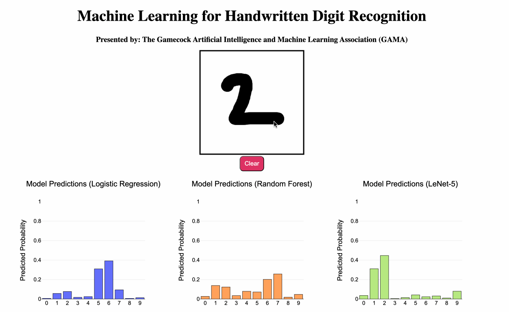

# Machine Learning for Handwritten Digit Recognition

Hello! This is an app I built for my engineering school's recent open house, where I wanted to demonstrate a cool AI application to lower/middle school kids. I wanted to do something simple that they could appreciate and would get them excited about AI without getting too technical. 

The final product is a small web app that allows you to draw a digit, and uses 3 different machine learning (ML) models to try and predict what you drew. The kids had a lot of fun trying to trick it!



## The Data and Models

All of my models are trained on the original 60,000 28 x 28 images in the [MNIST dataset](https://paperswithcode.com/dataset/mnist). 

There are 3 models integrated into the project. The first two are logistic regression (L2 penalty with $\alpha$ = 1.0) and a random forest (100 trees, maximum depth = 10). Both of these take a flattened image vector as input, for a length of 28 pixels x 28 pixels = 784 features.

The third (and best) model is my implementation of LeNet-5, trained using PyTorch. The hyperparameters are as follows:

- Loss function: cross entropy (no penalty)
- Optimizer: ADAM
- Learning rate: 0.0001
- Number of epochs: 10
- Batch Size: 128

It achieved a final cross-entropy of on its test set of 0.000357.

## Limitations

I didn't get around to implementing image centering or padding on the backend. I may do this later, but for now what this means is that the models (especially LR and RF) are sensitive to the position of the drawn digit.

As for padding, you may notice that if you draw a '9' too large, LeNet will confidently predict 4. This is because its pooling and convolution mechanisms ends up cutting/giving less weight to the sides of images.

## Setup

Environment + dependencies are managed with uv: [uv installation](https://docs.astral.sh/uv/getting-started/installation/)

Once uv is installed, build a suitable virtual environment with 

```
uv sync
```

To start the app, run

```
source start.sh
```

To kill the app, run

```
source kill.sh
```

## Tech Stack

Frontend: javascript + html. Plotly for the plots, canvas to draw digit

Backend: fastpi to recieve images + respond with predictions. Numpy, scikit-Learn, and pytorch for the models
